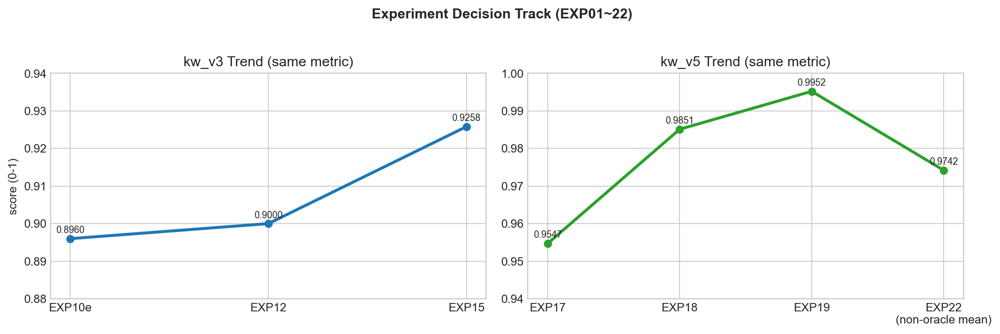
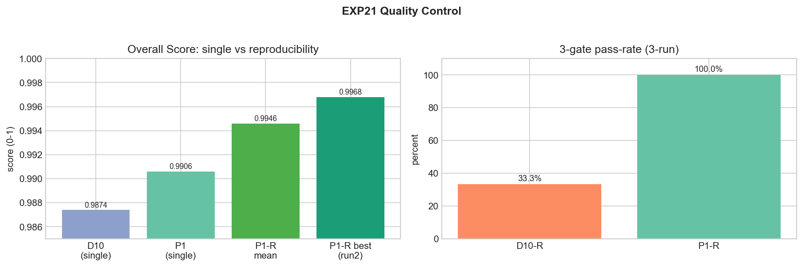
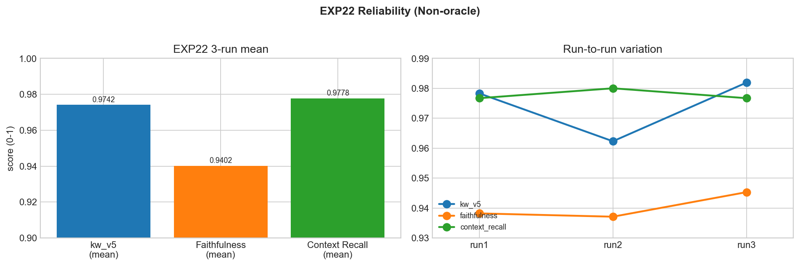
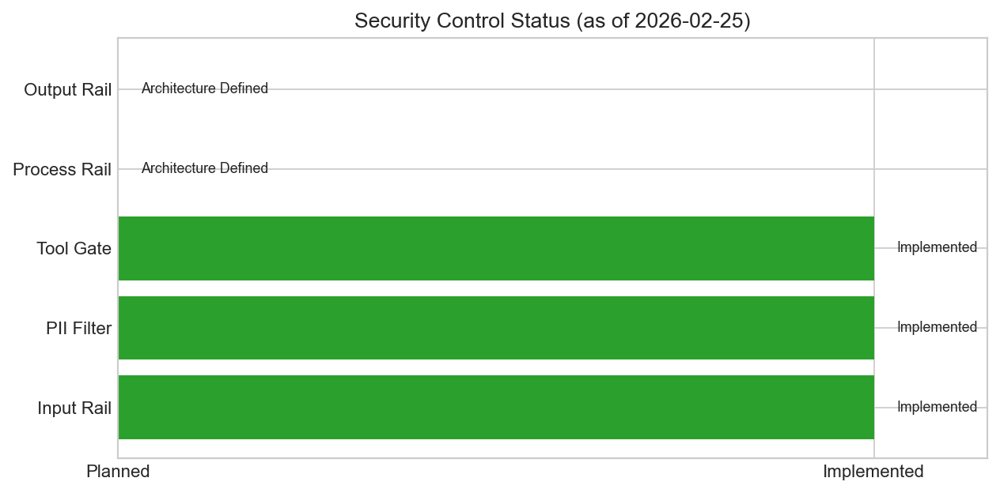

# BidFlow 최종 종합 보고서

- 프로젝트: `BidFlow` (`AI6_6team_Intermediate-Project`)
- 팀: `임창현, 김보윤, 김슬기`
- 작성일: `2026-02-26`
- 보고서 목적: 구현 기능, 실험 의사결정, 보안/운영 준비도를 하나의 문서에서 추적 가능하게 정리

## 1. Executive Summary

BidFlow는 공공 RFP 분석에서 가장 치명적인 실패인 `핵심 조건 누락`을 줄이기 위해 개발한 보안형 RAG 시스템입니다.  
핵심 설계는 `LLM은 추출`, `룰 엔진은 판정`으로 역할을 분리한 구조입니다.

최종 성과:

- 구현 측면: 업로드-추출-검증-협업까지 Next.js + FastAPI 단일 동선 완성
- 실험 측면: EXP01~EXP22를 one-lever 방식으로 운영해 개선/퇴행 원인을 분리
- 성능/안정성: EXP21 P1 단일 `0.9968 (48/50)`, P1-R 3-run gate pass-rate `100%`
- 실운영형 평가: EXP22 non-oracle 3-run mean `kw_v5=0.9742`, `Faithfulness=0.9402`, `Context Recall=0.9778`
- 보안/경계: Input Rail, PII Filter, Tool Gate, 사용자/팀 데이터 분리 적용

## 2. 구현된 기능과 동작 방식

### 2.1 End-to-End 흐름

1. 사용자 로그인 후 문서 업로드
2. 파서가 문서를 청킹/정규화하고 저장소 + 벡터DB에 적재
3. Hybrid Retrieval(BM25+Vector+RRF+Rerank)로 컨텍스트 구성
4. G1~G4 추출 체인 실행
5. RuleBasedValidator로 회사 프로필 대비 판정
6. 팀 워크스페이스에서 판정/코멘트 공유

### 2.2 기능 구현 매핑

| 기능 | 구현 방법 | 근거 파일 |
|---|---|---|
| 업로드/파싱 | `/api/v1/ingest/upload` -> `IngestService`가 확장자별 파싱 후 저장/인덱싱 | `src/bidflow/api/routers/ingest.py`, `src/bidflow/ingest/service.py` |
| 배치 업로드/분석 | 2개 이상 문서 동시 업로드 시 배치 UI + 일괄 추출 처리, 진행률 표시 | `src/bidflow/extraction/batch_pipeline.py`, `frontend/app/dashboard/page.tsx` |
| 파서 계층 | PDF/HWP/DOCX/HWPX 파서 모듈 + HWP HTML 테이블 파서 | `src/bidflow/parsing/*.py` |
| 저장/테넌시 | 사용자별 파일 경로 + 관계형 DB(SQLite 기본/PG 전환 지원) + Chroma 컬렉션, 벡터 ACL 메타데이터 | `src/bidflow/ingest/storage.py`, `src/bidflow/db/crud.py`, `src/bidflow/db/database.py` |
| 하이브리드 검색 | BM25 + Vector + Weighted RRF, 선택적 Cross-Encoder rerank | `src/bidflow/retrieval/hybrid_search.py`, `src/bidflow/retrieval/rerank.py` |
| 구조 인지 검색 | TOC 자동 감지 + chapter prefix 런타임 주입 (Q23 +60pp, Q24 +53pp 개선) | `src/bidflow/retrieval/structure_aware.py` |
| 힌트 탐지 | 정규식 기반 일정/면허 패턴 사전 탐지로 추출 보조 | `src/bidflow/extraction/hint_detector.py` |
| 추출 파이프라인 | G1->G2/G3->G4 멀티스텝 체인 + `with_structured_output` + 실패 fallback | `src/bidflow/extraction/pipeline.py`, `src/bidflow/extraction/chains.py` |
| 답변 후처리 | 추출 결과 정규화/보정 (stability_v1: 시점형/보안/공동수급 안정화) | `src/bidflow/extraction/postprocess.py` |
| 판정 엔진 | license/credit/region + budget/deadline/completeness 규칙 | `src/bidflow/validation/validator.py`, `configs/decision_rules.yaml` |
| 인증/권한 | JWT 인증 + bcrypt 해싱(legacy SHA-256 자동 마이그레이션), 역할(member/leader), 팀 프로필 1개 정책, in-memory rate limiting | `src/bidflow/api/main.py`, `src/bidflow/api/deps.py`, `src/bidflow/security/jwt_tokens.py`, `src/bidflow/security/passwords.py`, `src/bidflow/api/rate_limit.py` |
| 팀 협업 | 팀 문서 집계, 문서별 판정 요약(GO/NO-GO/REVIEW), 댓글/답글 스레딩 | `src/bidflow/api/main.py`, `frontend/components/CommentSection.tsx` |
| 프로필 관리 | 팀장 전용 회사 프로필/면허/지역/로고 편집, 팀원 읽기 전용 | `frontend/app/profile/page.tsx`, `src/bidflow/api/main.py` |
| 보안 | Input Rail + PII Filter(8종 패턴) + Tool Gate(SSRF 방어) + Output/Process Rail | `src/bidflow/security/*`, `src/bidflow/retrieval/rag_chain.py` |
| 관측/추적 | Langfuse 기반 추출/검색 체인 호출 추적 및 성능 관측 | `src/bidflow/extraction/pipeline.py`, `src/bidflow/retrieval/rag_chain.py` |
| 통합 런처 | FastAPI + Next.js 동시 기동, 포트 충돌 자동 회피, Ctrl+C 안전 종료 | `src/bidflow/launcher.py` |

### 2.3 현재 운용 상태(중요)

- Next.js 기본 업로드 경로(`/api/v1/ingest/upload`)는 `.pdf`, `.hwp`를 기준으로 운용
- 코드베이스에는 `.docx`, `.hwpx` 파서 모듈과 확장 로더 경로가 존재
- 즉, 파서 자산은 다포맷이지만 현재 기본 웹 동선은 PDF/HWP 중심
- 근거: 100문서 코퍼스 분석 결과 96건이 HWP, 4건이 PDF로 확인되어(EXP07~08), 실사용 빈도가 압도적인 두 포맷의 파싱 품질 최적화를 우선했습니다

## 3. 실험 설계 원칙과 평가 체계

### 3.1 실험 운영 원칙

- one-lever: 한 번에 하나의 변수만 변경
- 동일 지표 비교: `kw_v3`는 `kw_v3`끼리, `kw_v5`는 `kw_v5`끼리
- 단일 최고치보다 반복 안정성 우선
- 실험 산출물(JSON/CSV)과 실행 문서를 함께 남겨 재현성 확보

### 3.2 지표

#### kw (Keyword Accuracy) — 프로젝트 핵심 지표

GT(정답)의 키워드가 모델 응답에 포함되는 비율을 측정합니다.

```
kw = (GT 키워드 중 응답에 매칭된 수) / (GT 키워드 총수)
```

매칭 전 GT와 응답 양쪽에 동일한 정규화를 적용합니다: 숫자 내 쉼표 제거, 통화/퍼센트 붙임, 동의어 치환(예: ISMP↔정보화전략계획), 한국어 조사 제거(은/는/이/가/을/를 등) 등.

버전별 변경점:

| 버전 | 도입 시점 | 주요 변경 | 효과 |
|---|---|---|---|
| kw_v2 | EXP10 | 기본 정규화(숫자/통화/동의어) | baseline |
| kw_v3 | EXP11 | +한국어 조사 제거, +로마숫자 변환, +괄호 분리 | +8pp |
| kw_v4 | EXP16 | +날짜 형식 보존("14." 파괴 방지), +페이지/장 정규화 | 날짜 문항 정확도 복구 |
| kw_v5 | EXP17 | +동사 어미 제거("하며/되는/입니다" 등 30종), 3단계 매칭 | 최종 채택 |
| kw_v5b | EXP20 | +한국어 복합어 공백 제거 매칭(3자 이상 한글 단어) | 공백 변이 허용 |

kw_v5 3단계 매칭 로직:

1. **직접 매칭**: GT 키워드가 응답 텍스트에 부분 문자열로 존재
2. **어미 제거 매칭**: "수행하며" → "수행" 으로 어미를 떼고 재매칭
3. **공백 제거 매칭** (v5b): 3자 이상 한글 단어에 대해 응답의 공백을 모두 제거한 텍스트에서 재매칭

#### Perfect

kw_v5 = 1.0 (GT 키워드 전부 매칭)인 문항 수. 예: "48/50"은 50문항 중 48문항이 완전 정답.

#### Gate

split별 kw_v5 평균이 임계치를 넘는지 판정합니다.

| Split | 문항 수 | 임계치 | 역할 |
|---|---|---|---|
| dev | 30 | ≥ 0.99 | 개발 중 최적화 대상 |
| holdout_locked | 10 | ≥ 0.95 | 수동 검증된 일반화 검증용 |
| sealed_holdout | 10 | ≥ 0.95 | 미공개 최종 검증용 |

`overall_pass`는 dev AND holdout AND sealed 모두 통과해야 True.

#### Oracle / Non-oracle

Self-Consistency 5회(temp=0.0~0.5) 생성 후 **어떤 응답을 선택하는가**의 차이:

- **Oracle**: 5개 응답 각각을 GT와 비교하여 kw_v5가 가장 높은 응답을 선택. GT에 의존하므로 운영 환경에서는 사용 불가
- **Non-oracle (first_deterministic)**: temp=0.0의 첫 번째 응답을 그대로 사용. GT 불필요, 운영 환경 적용 가능
- **Oracle gap**: oracle 점수와 non-oracle 점수의 차이. EXP22 mean = 2.33pp

#### Self-Consistency (SC)

동일 질문에 대해 temperature를 바꿔가며 5회 생성(0.0, 0.1, 0.2, 0.3, 0.5)한 뒤 선택 전략을 적용합니다.

- **consensus_v1**: 정규화 후 다수결 투표, 동점 시 Jaccard 유사도(`|A∩B|/|A∪B|`)로 중심 응답 선택
- **first_deterministic**: temp=0.0 응답 고정 (EXP22 최종 채택)

#### Faithfulness / Context Recall (RAGAS)

RAGAS 0.4.3 라이브러리의 표준 지표입니다. gpt-5-mini를 judge LLM(temp=1 고정)으로 사용합니다.

- **Faithfulness**: 응답의 각 주장(claim)이 검색된 컨텍스트에 근거하는지 판정. 범위 [0, 1]
- **Context Recall**: GT의 각 문장이 검색된 컨텍스트에서 지원되는지 판정. 범위 [0, 1]
- judge 컨텍스트: 상위 10개 청크, 최대 15,000자

#### stdev

3-run 반복 실행 시 지표의 표준편차. 시스템 안정성을 계측합니다.
- kw_v5 stdev = 1.04pp (허용 가능)
- Faithfulness stdev = 0.45pp, Context Recall stdev = 0.19pp (매우 안정)

### 3.3 평가 데이터 운영

#### GT(Ground Truth) 정의

GT는 각 질문에 대해 **사람이 원문 RFP에서 직접 추출·정리한 정답 텍스트**입니다.

- 작성 규칙: 1~2문장, 핵심 키워드(사업명/예산/마감일/기관명 등) 보존, 페이지·절 번호 제거, 원문 이상의 정보 확장 금지
- 예시: 질문 "사업기간은?" → GT "계약일로부터 4월(120일)"
- 각 GT에는 `evidence_span`(원문 근거 구간)이 함께 기록되어 검색 단계 진단과 RAGAS 평가에 활용

#### 평가 문서 구성

EXP08 EDA 기반으로 문서 복잡도 5유형을 커버하도록 층화 추출했습니다.

**Dev 문서 (5문서 × 6문항 = 30문항)**:

| 레이블 | 문서명 | 유형 | 비고 |
|---|---|---|---|
| doc_A | 수협중앙회 수산물사이버직매장 재구축 | text_only | 테이블 0개 |
| doc_B | 한국교육과정평가원 NCIC 운영 개선 | table_simple | 테이블 75개 |
| doc_C | 국립중앙의료원 응급의료 시스템 | table_complex | 테이블 246개 |
| doc_D | 한국철도공사 예약발매 ISMP | mixed | 테이블+텍스트 혼합 |
| doc_E | 스포츠윤리센터 LMS 기능개선 | hwp_representative | HWP 대표 문서 |

**Holdout/Sealed 문서 (5문서 × 4문항 = 20문항)**: dev와 다른 산업 도메인(의료연구, 지자체재난, 산업안전, 공공교육, 문화예술)에서 선정. 문서당 2문항씩 holdout_locked과 sealed_holdout에 결정론적으로 분할.

#### Split 설계와 역할

| Split | 문항 | Gate 임계치 | 역할 |
|---|---|---|---|
| dev | 30 | ≥ 0.99 | 파라미터 튜닝/프롬프트 최적화 대상 |
| holdout_locked | 10 | ≥ 0.95 | dev 과적합 감지 (다른 도메인 문서) |
| sealed_holdout | 10 | ≥ 0.95 | 최종 검증, 개발 중 결과 비공개 |

3단계 split을 둔 이유: EXP19-B에서 dev만으로 최적화했을 때 holdout에서 **11pp 성능 하락**(kw_v5 0.99→0.88)이 발생. 이후 holdout으로 과적합을 감시하고, sealed로 최종 신뢰도를 검증하는 구조를 확립.

#### GT 정제 이력

- **EXP19-B**: holdout GT가 dev GT 대비 2.5배 길고 스타일이 달라 11pp gap 발생
- **EXP19-C**: holdout GT를 dev와 동일한 작성 규칙으로 재작성 → gap 해소(holdout 0.9671)
- **Phase D1**: 전 split lock + SHA256 manifest 생성. 이후 GT 수정 금지

#### 무결성 관리

- lock 버전: `exp19_phase_d_v1` (2026-02-23)
- 각 split 파일의 SHA256 해시를 `exp19_phase_d_split_manifest.json`에 기록
- 실험 실행 전 해시 검증으로 데이터 변조 방지

## 4. 실험 여정: 막힘과 다음 실험의 연결

아래는 "무엇이 막혔고 -> 왜 다음 실험을 했는지"를 기준으로 정리한 의사결정 로그입니다.

### 4.1 EXP01~EXP09: 기반 구축과 과적합 신호

| 실험 | 시도 | 대표 지표 | 막힌 지점 | 다음 액션 |
|---|---|---|---|---|
| EXP01 | 청킹 최적화: chunk_size [500/1000/2000] × table전략 [text/layout] 6종 그리드 서치 | CtxRecall 0.7333 (chunk=500, layout 최적) | 청킹만으로 성능 한계, 검색 가중치 미최적화 | 하이브리드 검색 파라미터 탐색 |
| EXP02 | 하이브리드 검색: alpha [0.0~1.0] × top_k [5/10/15] 15종 그리드 서치 | CtxRecall 0.7667, MRR 0.4195 (alpha=0.5, top_k=15) | 검색 재현율 확보했으나 생성 품질(KW 정확도 0.49) 부족 | 프롬프트 전략 비교 실험 |
| EXP03 | 프롬프트 전략 4종: zero_shot_en/ko, few_shot_ko, cot_ko | Faithfulness 0.9632 (zero_shot_ko), 영어 대비 **+10pp** | 한국어 프롬프트로 충실도 대폭↑, 그러나 KW 정확도(0.49) 여전히 낮음 | 파이프라인 구성요소별 체계적 ablation |
| EXP04 | 파이프라인 ablation 6종: baseline→+metadata→+verbatim→+reranker→+decompose→+grading | KW Acc 0.664 (verbatim), baseline(0.443) 대비 **+22pp** | verbatim이 최대 기여, 전체 파이프라인 적용 시 느림(2050s) | 실패 유형별 targeted 개선 |
| EXP05 | 단계적 개선: 프롬프트 정제(extract 전략) + elbow 동적 컷오프 | KW Acc 0.7058 (elbow cut, +5.5pp) | 단일 문서 성능 포화 조짐 | 3-run 반복으로 안정성 검증 도입 |
| EXP06 | 3-run 안정성 검증 + typed-cut vs uniform-elbow 비교 | KW_v2 0.7240 ± 0.0021 (stdev 극소) | 안정성 확보, 단일 문서 최적화 한계 | 테이블 구조화 고도화 |
| EXP07 | 테이블 인지 RAG: HWP HTML 테이블 구조화 + TableAwareChunker | KW Acc 0.7479 ± 0.0105, CtxRecall 0.8667 | 단일 문서 성능 한계 도달 | 100문서 코퍼스 EDA |
| EXP08 | 코퍼스 EDA: 100문서 포맷/구조/섹션 커버리지 분석 | 96 HWP + 4 PDF, 추출 성공률 97%, 평균 테이블 96.8개/문서 | HWP 테이블 파싱 한계 + 문서 간 구조 편차 발견 | 다문서 일반화 검증 착수 |
| EXP09 | 일반화 검증: central 80 + extreme 20문서, 라우팅 전략 3종 비교 | worst-group KW_v2 0.258, 타임아웃 26% | **과적합 확인 — 단일 파이프라인으로 프로덕션 불가** | V4_hybrid 파서 + 다문서 testset 재구성 |

핵심 교훈:

- **EXP01~03 (baseline 수립)**: chunk_size=500, hybrid alpha=0.5, 한국어 zero-shot 프롬프트가 각각 최적임을 확인. 특히 EXP03에서 프롬프트 언어를 한국어로 변경하는 것만으로 Faithfulness가 +10pp 개선된 것이 이후 모든 프롬프트 설계의 기반이 됨
- **EXP04~07 (단일문서 고도화)**: verbatim 추출(+22pp), elbow 컷오프(+5.5pp), 테이블 구조화 등 개별 기법의 기여를 체계적으로 분리. EXP06에서 3-run 프로토콜을 도입해 stdev 0.002 수준의 안정성을 확인하며, 이후 모든 실험에서 반복 검증을 필수 프로토콜로 채택
- **EXP08~09 (현실 충돌)**: 단일 문서에서 KW Acc 0.74까지 끌어올렸으나, 100문서 일반화 검증(EXP09)에서 worst-group 0.258로 폭락하고 타임아웃이 26%에 달함. 단일 파이프라인의 구조적 한계를 확인하고, 이후 모든 실험을 다문서(5문서 50문항) 기준으로 전환

### 4.2 EXP10~EXP13: 일반화 복구 시도

| 구간 | 시도 | 대표 지표 | 막힌 지점 | 다음 액션 |
|---|---|---|---|---|
| EXP10 | 다문서 testset(5문서 30문항) + V4_hybrid 파서 도입. 문서 유형별 대표 선정(text_only, table_simple/complex, mixed, hwp) | kw_v3 ~0.87 (쉬운 문항 100%, 어려운 문항 30~67%) | 질문 유형별 성능 편차 큼(예산/일정 100% vs 규정/유지보수 30~67%), 테이블 gap 잔존 | generation 개선 분리 실험 필요 |
| EXP11~12 | generation/prompt 및 retrieval 파라미터 조정 | 일부 config baseline 미달 | 개선이 불안정, 일부 조합에서 퇴행 | 실패 유형 분해(원인 진단)로 전환 |
| EXP13 | contextual retrieval 도입 시도 | 전 config baseline 미달 | **부정 결과** (한국어 RFP 도메인에서 비효과) | EXP14 오답 유형 분해로 경로 수정 |

핵심 교훈: 멀티쿼리/contextual retrieval 같은 범용 기법이 한국어 RFP 도메인에서는 오히려 성능을 저하시켰습니다(EXP13 전면 기각). 이후 "오답 원인을 먼저 분해한 뒤 정밀 개선"하는 전략으로 전환했습니다.

### 4.3 EXP14~EXP18: 실패 원인 분해 후 정밀 개선

| 실험 | 관찰된 문제 | 대응 | 결과 |
|---|---|---|---|
| EXP14 | imperfect 11건 원인 불명확 | 오류를 `gen_failure` vs `partial_retrieval`로 분해 | `gen 6 / partial 5`로 우선순위 확정 |
| EXP15 | generation 품질 부족 | self-consistency 3-shot 중심 개선 | `kw_v3=0.9258` |
| EXP16 | 지표 민감도와 선택전략 불일치 | metric v4 + SC 5-shot 검증 | `kw_v4=0.9534` (0.95 달성) |
| EXP17 | 0.99 미달 | metric v5로 재평가, 병목 확인 | `kw_v5=0.9547`, GT/retrieval 한계 확인 |
| EXP18 | 잔여 오답 지속 | GT 정제 + targeted prompt | `kw_v5=0.9851`, `28/30 perfect` |

### 4.4 EXP19~EXP20v2: 고점 달성 후 일반화/재현성 검증

| 단계 | 관찰된 문제 | 대응 | 결과 |
|---|---|---|---|
| EXP19 (Dev) | 0.99 목표 필요 | targeted prompt 보강 | Dev `kw_v5=0.9952` (29/30) 달성 |
| EXP19-B | Dev 성능이 holdout에 재현 안 됨 | holdout 검증 | Holdout raw `0.8821` (SEVERE 과적합) |
| EXP19-C | GT 품질/문항 해석 이슈 | GT 보정 + Q1 보완 | Holdout `0.9671` 회복 |
| EXP19-D2~D8 | benchmark lock 후 범용화 시도 | prompt/retrieval 조합 탐색 | D7에서 dev gate 통과, D8 sealed 미통과 |
| EXP20 D9 | split별 gate 불균형 | metric v5b(space/paren/slash 보정) | holdout/sealed gate 통과(2/3) |
| EXP20v2 D10 | dev 2건 잔여 실패 | eval_v1 후처리 추가 | 단일 run 3/3 gate 통과 |
| EXP20v2 D10-R | 단일 통과가 반복에서 유지 안 됨 | 3-run 재현성 확인 | overall pass-rate `33.3%` (불안정) |

### 4.5 EXP21: 안정화 백로그(P1~P5) 분해 실험

D10-R 불안정의 원인을 분리하기 위해 안정화 백로그를 독립 phase로 실행했습니다.

| Phase | 변경 | 결과 | 채택 여부 |
|---|---|---|---|
| P1 | `answer_postprocess=stability_v1` | `0.9968`, 48/50, 3-gate 통과 | 채택 |
| P2 | P1 + `decode_policy=type_v1` | `0.9928`, 3-gate 통과 | 보류(이득 제한) |
| P3 | P2 + consensus_v1 + deterministic retrieval | dev 급락(`0.9555`) | 기각 |
| P4 | P2 + deterministic retrieval(oracle 유지) | dev 미달(`0.9737`) | 기각 |
| P5 | P4 + guarded consensus | dev 미달(`0.9737`) | 기각 |

핵심:

- `P1`이 성능/안정성 동시 최적점
- `P1-R` 3-run에서 dev/holdout/sealed/overall gate `3/3 (100%)`
- D10-R(33.3%) 대비 재현성 구조적 개선 확인

### 4.6 EXP22: 평가 신뢰성 고도화

EXP21까지의 점수는 일부 oracle 성격이 남아 있어, EXP22에서 평가 체계를 운영 기준으로 전환했습니다.

핵심 변경:

1. `selection_mode=first_deterministic`로 GT 의존 선택 제거
2. RAGAS(Faithfulness, Context Recall) 추가
3. 3-run 반복으로 변동성 계측

결과:

- non-oracle `kw_v5` mean `0.9742`, stdev `0.0104`
- oracle mean `0.9974`, gap mean `2.33pp`
- Faithfulness `0.9402 ± 0.0045`
- Context Recall `0.9778 ± 0.0019`
- gate 패턴은 3-run 모두 `Dev FAIL / Holdout PASS / Sealed PASS`로 일관

판정:

- 점수만 높은 평가에서 벗어나, 실운영 기준의 신뢰 가능한 평가 체계로 확정

### 4.7 최종 확정 파이프라인 설정 (EXP21 P1 / EXP22 기준)

EXP01~EXP22를 거쳐 확정된 운영 설정입니다.

| 구분 | 설정값 | 확정 근거 |
|---|---|---|
| Parser | V4_hybrid (hwp5txt 텍스트 + hwp5html 테이블) | EXP07~10에서 테이블 파싱 품질 검증 |
| chunk_size / overlap | 500 / 50 | EXP01 그리드 서치에서 500이 최적 |
| Embedding | text-embedding-3-small | 한국어 RFP 도메인 비용/성능 균형 |
| Vector DB | ChromaDB (`collection_name='bidflow_rfp'`) | 컬렉션명 변경 시 재인덱싱 필요 |
| Retrieval pool_size | 50 | 충분한 후보 확보 후 rerank로 정밀화 |
| Hybrid alpha | 0.7 (Vector 0.7 + BM25 0.3) | EXP02 기반, 이후 튜닝에서 0.7로 수렴 |
| top_k | 20 | EXP15~16에서 SC와 조합 최적화 |
| Reranker | BAAI/bge-reranker-v2-m3 (Cross-Encoder) | EXP04 ablation에서 recall 복구 효과 확인 |
| Structure-Aware | TOC 자동 감지 + Chapter Prefix 런타임 주입 | Q23(+60pp), Q24(+53pp) 해결 |
| Prompt | V5 (8규칙, TOC 활용 규칙8 신설) | EXP17~19에서 단계적 정교화 |
| LLM | gpt-5-mini | 비용/속도/품질 균형 |
| Self-Consistency | 5회 (temp=0.0, 0.1, 0.2, 0.3, 0.5) | EXP15~16에서 SC 도입, 5-shot이 안정적 |
| Selection (oracle) | best oracle + stability_v1 후처리 | EXP21 P1 — 최고 성능 |
| Selection (운영) | first_deterministic (temp=0.0) | EXP22 — oracle gap 2.33pp로 실용적 |
| 후처리 | stability_v1 (시점형/보안/공동수급 정규화) | EXP21 P1에서 3-run 100% gate 확보 |

## 5. 지표/결과 시각화

### 5.1 실험 추세



핵심 해석:

- `kw_v3`: 0.8960(초기) -> 0.9258(EXP15)
- `kw_v5`: 0.9547(EXP17) -> 0.9952(EXP19, oracle 성격)
- EXP22 mean 0.9742는 non-oracle 기준의 운영 성능

### 5.2 성능 + 재현성 (EXP21)



| 구분 | Overall(kw_v5) | Perfect | 비고 |
|---|---:|---:|---|
| D10 단일 | 0.9874 | 46/50 | 안정화 전 |
| P1 단일(best) | 0.9968 | 48/50 | 최종 채택안 |
| P1-R 3-run 평균 | 0.9946 | - | 반복 기준 |

### 5.3 신뢰성 (EXP22)



핵심 수치(3-run 평균):

- `kw_v5(non-oracle)=0.9742`
- `Faithfulness=0.9402`
- `Context Recall=0.9778`
- `Oracle gap=2.33pp`

## 6. 보안 설계 및 적용 상태



### 6.1 보안 레이어 상세

운영 파이프라인에 3단계(Input → Process → Output) 레일을 적용했습니다.

**Input Rail** (`security/rails/input_rail.py`):
- 프롬프트 인젝션/탈옥 시도 차단 (정규식 + 문자열 매칭)
- 탐지 패턴: "ignore previous instructions", "system prompt", "jailbreak", "DAN mode", "act as", "simulate" 등
- 탐지 시 `SecurityException` 발생 → Fail Closed

**PII Filter** (`security/pii_filter.py`):
- 8종 개인정보 패턴 탐지 및 자동 마스킹:
  - 주민등록번호, 외국인등록번호, 신용카드, 이메일, 운전면허, 전화번호, 여권번호, IP 주소
- 입력(업로드/쿼리) → 처리(문서 파싱) → 출력(LLM 응답) 3단계에서 적용
- DoS 방어: 입력 텍스트 최대 길이 제한(기본 2,000자)

**Tool Gate** (`security/tool_gate.py`):
- allowlist 기반 도구 실행 제어: `search_rfp`, `get_company_profile`만 허용
- SSRF 방어: 사설 IP 대역(10.0.0.0/8, 172.16.0.0/12, 192.168.0.0/16), localhost, 클라우드 메타데이터 엔드포인트 차단
- LangChain 도구 래핑: `apply_to_langchain_tool()`로 도구 실행 전 자동 검증

**Output Rail / Process Rail** (`security/rails/output_rail.py`, `process_rail.py`):
- 응답 내 PII 유출 탐지 및 차단
- 허용 도메인 화이트리스트 기반 제어
- 근거(Evidence) 인용 검증

**보안 로그**:
- `logs/security.log`: 위협 이벤트 (인젝션 탐지, PII 유출 시도)
- `logs/audit.log`: 일반 감사 이벤트 (로그인, 문서 접근, 추출 실행)
- RotatingFileHandler로 로그 파일 자동 회전

### 6.2 보안 원칙

- **Isolation First**: 사용자/팀 데이터를 검색 단계부터 격리 (벡터DB ACL 메타데이터)
- **Defense in Depth**: 업로드 → 파싱 → 검색 → 응답 전 단계에 다중 검증
- **Fail Closed**: 검증 실패 시 허용이 아닌 차단이 기본값
- **Auditability**: 모든 위협/정상 이벤트를 분리 기록하여 포렌식 가능

## 7. 사내 적용 관점 정리

### 7.1 인증/권한/프로필 정책

- 인증: JWT(HS256) 토큰 기반, bcrypt 비밀번호 해싱 (legacy SHA-256 로그인 시 자동 업그레이드)
- 역할 분리: `member`, `leader`
- 팀 프로필 1개 정책: 팀장이 갱신, 팀원 fallback 동기화
- API 보호: in-memory rate limiting (auth 20req/60s, general 240req/60s, 429 + Retry-After)
- `/auth/me`, `/api/v1/validate`, `/api/v1/team/decision/*` 경로에서 정책 일관 적용

### 7.2 데이터 경계

- 사용자 경로: `data/accounts/{user_id}/...`
- 팀 공유 경로: `data/shared/teams/{team_name}/...`
- 벡터DB ACL 메타데이터로 조회 범위 제한

### 7.3 협업 UX

- 팀 문서 목록 + 문서별 GO/NO-GO/REVIEW 요약
- 댓글/답글/삭제로 리뷰 이력 관리

## 8. 팀 기여 정리

| 이름 | 핵심 기여 |
|---|---|
| 임창현 | PM/기획(아이디어 제안·전체 방향 수립), RAG 파이프라인 설계/실험 운영, 최종 성능/안정화 의사결정 주도 |
| 김보윤 | QueryAnalyzer/DecisionEngine 계열, 인증/팀 워크스페이스/프로필 정책 |
| 김슬기 | Front-loading/힌트 주입/구조 인지 검색, 보안 레이어 및 웹 연동 고도화 |

근거: `docs/final_presentation/team_contributions.md`

## 9. 한계와 다음 단계

현재 한계:

- **성능**: non-oracle 기준 dev gate(0.99) 미달 구조 존재 (3-run 모두 dev FAIL, mean 0.9741)
- **평가**: judge context mismatch (chapter prefix 미전달 → RAGAS false negative 2건) 등 평가 파이프라인 세부 개선 여지
- **인증**: JWT + bcrypt로 전환 완료. 현재 과제는 refresh token/강제 로그아웃 정책 추가
- **데이터베이스**: PostgreSQL 전환 경로(`BIDFLOW_DATABASE_URL`) 지원 완료. 운영 환경에서는 커넥션 풀/백업정책 튜닝 필요
- **API 보안**: 기본 rate limiting 적용 완료. 분산 인스턴스 환경에서는 Redis 기반 분산 limiter로 확장 필요
- **프론트엔드**: 전역 lint debt 및 배포 자동화 미완, SSR 미활용(전 페이지 CSR)

다음 단계(우선순위):

1. EXP22 후속: judge context 정합 개선(chapter prefix 포함) + gate 기준 재정의(non-oracle 기준 0.97로 조정)
2. 인증 강화(후속): refresh token + 세션 강제 무효화(로그아웃/탈퇴/비밀번호 변경 연동)
3. 평가 자동화: 정기 리그레션 + 품질 임계치 알람
4. 배포 안정화: CI/CD, 로그 대시보드, 장애 대응 절차
5. 보안 확장: Process/Output Rail 정책 전면 적용, rate limiting을 Redis 기반 분산 제어로 확장
6. DB 확장: PostgreSQL 운영 튜닝(인덱스/풀 사이즈/백업/복구 리허설)

## 10. 재현 체크리스트

1. `docs/planning/HISTORY_v2_execution.md`와 `data/experiments/*` 수치 일치 확인
2. `single-run`, `3-run mean`, `best-run` 라벨 분리 표기 확인
3. 구현 완료 기능 vs 확장 예정 기능 구분 확인
4. 실험 의사결정의 연결(막힘 -> 다음 실험)이 문서에 명시되었는지 확인
5. 팀원별 기여가 문제/구현/성과 3축으로 설명 가능한지 확인

---

## 참고 소스

- `docs/planning/HISTORY_v2_execution.md`
- `docs/planning/EXP20v2_phase_d10_execution.md`
- `docs/planning/EXP21_phase_stability_execution.md`
- `docs/planning/EXP22_llmjudge_execution.md`
- `docs/planning/next_fastapi_unification_execution_2026-02-26.md`
